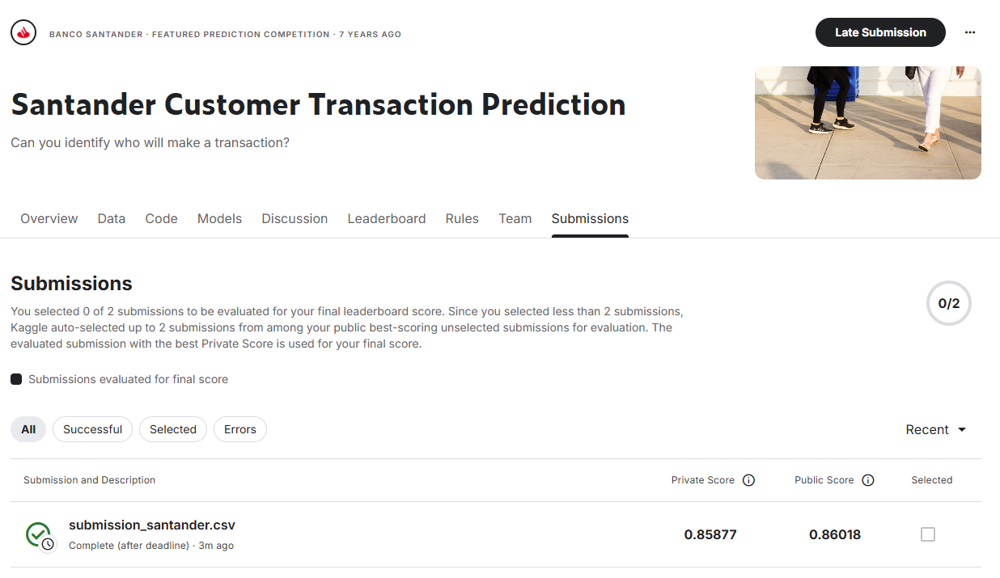

# Machine Learning - Santander Transaction Prediction (Final Project)

**Final Project (Grade 95, M.Sc. Data Science, HIT). Binary classification of customer transactions on the [Santander Kaggle competition](https://www.kaggle.com/c/santander-customer-transaction-prediction) — 200,000 records, 200 anonymized features, 9:1 class imbalance (hence AUC-ROC as the target metric).**

## Key Features

- **Feature Engineering at Scale:** 217 statistical features engineered on top of the 200 anonymized originals.
- **Feature Selection:** Importance-based narrowing to the 65 most impactful — a leaner model that filters statistical noise.
- **Model Comparison:** CatBoost vs. Logistic Regression baseline, with train/validation/test gap tracking against overfitting.
- **External Validation:** Final model submitted to Kaggle and scored on the competition's unseen test set.

## Results

AUC **0.894** validation / **0.859** Kaggle private leaderboard — a modest 0.035 generalization gap on the competition's fully unseen test set.

## Repository Structure

- **`Santander_Transaction_Prediction_Final.ipynb`**: Full implementation — EDA, feature engineering, selection, modeling, Kaggle submission (Hebrew narrative; code and charts are language-independent).
- **`Final_Project_Instructions.pdf`**: Original project instructions.
- **`train.csv` / `test.csv`**: The official competition datasets (via Git LFS).
- **`sample_submission.csv` / `submission_santander.csv`**: Submission template and final predictions.
- **`kaggle_score.png`**: Official Kaggle leaderboard score screenshot.
